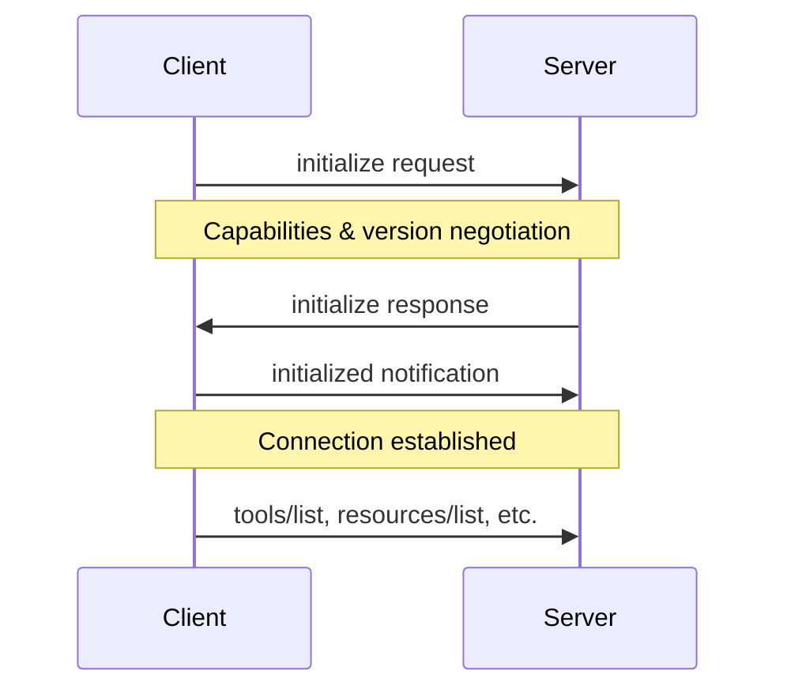

# ⚠️ CRITICAL UPDATE: VS Code Has Built-in MCP Support!

**Date Updated:** February 7, 2026  
**Status:** ANALYSIS OBSOLETE - VS Code 1.109+ provides native MCP client APIs

---

## 🔴 Major Discovery

**VS Code 1.109+ includes native MCP client functionality via `vscode.lm` APIs.**  
Extensions should NOT implement their own MCP clients using the MCP SDK.

### What This Means For Our Implementation

**❌ Don't Do This (Original Plan):**
- Install `@modelcontextprotocol/sdk`
- Implement MCP client with JSON-RPC handling
- Manage server subprocesses
- Handle MCP protocol handshakes

**✅ Do This Instead (Correct Approach):**
- Use `vscode.lm.registerMcpServerDefinitionProvider()` to register servers
- Use `vscode.lm.tools` to list all available tools
- Use `vscode.lm.invokeTool()` to execute tools
- Let VS Code handle ALL MCP protocol communication

### Architecture Comparison

**Old (Wrong):**
```
Extension → MCP SDK → stdio → MCP Server
```

**New (Correct):**
```
Extension → VS Code LM API → VS Code (MCP Client) → MCP Server
```

### Code Example (Using VS Code API)

```typescript
// 1. Tell VS Code about MCP servers
class MyMCPProvider implements vscode.McpServerDefinitionProvider {
  provideMcpServerDefinitions(): vscode.McpServerDefinition[] {
    return [
      new vscode.McpStdioServerDefinition(
        'my-server',
        'python',
        ['server.py']
      )
    ];
  }
}

// 2. Register provider
vscode.lm.registerMcpServerDefinitionProvider('my-provider', new MyMCPProvider());

// 3. List all tools (from all MCP servers + extensions)
const tools = vscode.lm.tools;

// 4. Execute any tool
const result = await vscode.lm.invokeTool('tool-name', {
  toolInvocationToken: undefined,
  input: { param: 'value' }
});
```

### Benefits of Using VS Code API

| Factor | MCP SDK (Wrong) | VS Code API (Correct) |
|--------|----------------|----------------------|
| Dependencies | +17 packages | 0 (built-in) |
| Code complexity | ~550 LOC | ~150 LOC |
| Bundle size | +300KB | 0 |
| Protocol handling | Manual | Automatic |
| Server lifecycle | Manual | Automatic |
| Integration | Poor | Native |
| User experience | Custom | Built-in UI |
| **Winner** | ❌ | ✅ |

### Updated Implementation Plan

See revised plan at: [plans/real-mcp-integration-plan.md](plans/real-mcp-integration-plan.md)

**Key Changes:**
- Phase 1: Implement `McpServerDefinitionProvider` (not MCP client)
- Phase 2: Read configs and register with VS Code
- Phase 3: Use `vscode.lm.tools` (not manual tool listing)
- Phase 4: Use `vscode.lm.invokeTool()` (not manual execution)
- Phase 5: Leverage VS Code's built-in lifecycle management

### Requirements

- **Minimum VS Code:** 1.109.0
- **API Documentation:** https://code.visualstudio.com/api/references/vscode-api#lm
- **External Dependencies:** None needed

---

# Original Analysis (For Historical Reference Only)

**The analysis below is now OBSOLETE.** It compared MCP SDK vs manual implementation, but both approaches are wrong now that VS Code has native MCP support.

---

# MCP SDK vs Manual Implementation: Technical Analysis

**Date:** February 7, 2026  
**Question:** Can we implement MCP client functionality using only VS Code APIs and Node.js built-ins, or do we need `@modelcontextprotocol/sdk`?

---

## Executive Summary

**Recommendation: Use the MCP SDK (`@modelcontextprotocol/sdk`)**

While it's *technically possible* to implement MCP from scratch using Node.js built-ins, the SDK provides substantial value that far outweighs the dependency cost. A manual implementation would require ~400-800 LOC for basic functionality, missing critical features, and create ongoing maintenance burden.

**Key Finding:** MCP is more complex than simple JSON-RPC 2.0 – it adds protocol layers for initialization, capability negotiation, and multiple advanced features that would be time-consuming to implement correctly.

---

## 1. What Does the MCP SDK Provide?

### Package Information
- **Package:** `@modelcontextprotocol/sdk` (v1.26.0, latest stable)
- **Repository:** https://github.com/modelcontextprotocol/typescript-sdk
- **Popularity:** 11,528 GitHub stars, actively maintained
- **License:** MIT
- **Version Status:** v1.x is production-ready; v2 in development (Q1 2026)

### Core Functionality

#### 1.1 Protocol Implementation
- **Full JSON-RPC 2.0 handling:**
  - Request/response correlation via `id`
  - Notification support (fire-and-forget)
  - Batch request handling
  - Error codes and structured error responses
  - Message validation and parsing

- **MCP Protocol Layer:**
  - `initialize` / `initialized` handshake sequence
  - Protocol version negotiation (supports multiple versions)
  - Capability advertisement and negotiation
  - List/update notifications for tools, resources, prompts
  - Lifecycle management (ping, shutdown)

#### 1.2 Transport Abstractions
- **stdio transport:** For subprocess-based servers
- **Streamable HTTP:** Modern remote server support
- **HTTP + SSE (Server-Sent Events):** Backwards compatibility
- Transport interface allows custom implementations

#### 1.3 Client API (High-Level)
```typescript
// SDK provides clean API:
const tools = await client.listTools();
const result = await client.callTool({ name: 'status' });
const resources = await client.listResources();
const prompt = await client.getPrompt({ name: 'greeting' });
```

#### 1.4 Advanced Features
- **Sampling:** Server-side LLM completion requests
- **Form Elicitation:** Structured user input collection
- **URL Elicitation:** Browser-based secure flows (OAuth, payments)
- **Tasks (Experimental):** Long-running async operations
- **Logging:** Structured server-to-client log streaming
- **Resource Templates:** Dynamic resource URIs with completion
- **OAuth Support:** Client credentials, private_key_jwt flows

#### 1.5 Type Safety & Validation
- **Zod schemas:** Runtime validation of all messages
- **TypeScript types:** Full type safety across the API
- **JSON Schema support:** Tool output validation (via Ajv)
- **Custom type extensions:** Extensible for custom protocols

### Dependencies (v1.26.0)
```json
{
  "ajv": "^8.17.1",
  "zod": "^3.25 || ^4.0",
  "cors": "^2.8.5",
  "hono": "^4.11.4",
  "jose": "^6.1.3",
  "express": "^5.2.1",
  "raw-body": "^3.0.0",
  "ajv-formats": "^3.0.1",
  "cross-spawn": "^7.0.5",
  "eventsource": "^3.0.2",
  "content-type": "^1.0.5",
  "pkce-challenge": "^5.0.0",
  "@hono/node-server": "^1.19.9",
  "json-schema-typed": "^8.0.2",
  "eventsource-parser": "^3.0.0",
  "express-rate-limit": "^8.2.1",
  "zod-to-json-schema": "^3.25.1"
}
```

**Note:** Most dependencies are for server-side features (Express, Hono, CORS). Client-only usage requires fewer dependencies.

---

## 2. Node.js Built-ins Available in VS Code Extensions

### 2.1 Process Management
✅ **`child_process`** – Full subprocess control
```javascript
const { spawn } = require('child_process');
const server = spawn('python', ['server.py']);
```

### 2.2 Stream APIs
✅ **Readable/Writable streams** – stdin/stdout/stderr
```javascript
server.stdin.write(JSON.stringify(message) + '\n');
server.stdout.on('data', (chunk) => { /* parse JSON-RPC */ });
```

### 2.3 Data Processing
✅ **JSON parsing** – `JSON.parse()` / `JSON.stringify()`  
✅ **Buffer handling** – `Buffer.from()`, `Buffer.concat()`  
✅ **String manipulation** – All standard String methods  

### 2.4 Event Handling
✅ **EventEmitter** – For message dispatching  
✅ **Promise/async-await** – Modern async patterns  
✅ **setTimeout/setInterval** – For retries, timeouts  

### 2.5 VS Code APIs
✅ **Settings access** – `vscode.workspace.getConfiguration()`  
✅ **Output channels** – `vscode.window.createOutputChannel()`  
✅ **Progress indicators** – `vscode.window.withProgress()`  

**Verdict:** All necessary primitives are available to build MCP from scratch.

---

## 3. JSON-RPC 2.0 Protocol Complexity

### 3.1 Specification Summary
JSON-RPC 2.0 is intentionally simple:

**Request:**
```json
{
  "jsonrpc": "2.0",
  "method": "tools/list",
  "params": {},
  "id": 1
}
```

**Response (Success):**
```json
{
  "jsonrpc": "2.0",
  "result": { "tools": [...] },
  "id": 1
}
```

**Response (Error):**
```json
{
  "jsonrpc": "2.0",
  "error": {
    "code": -32601,
    "message": "Method not found"
  },
  "id": 1
}
```

**Notification (no response expected):**
```json
{
  "jsonrpc": "2.0",
  "method": "notifications/cancelled",
  "params": { "requestId": 1 }
}
```

### 3.2 Implementation Complexity

| Feature | Complexity | LOC Estimate |
|---------|-----------|--------------|
| Message framing (newline-delimited) | Low | 20-30 |
| Request/response correlation | Low | 30-50 |
| Error handling (standard codes) | Medium | 40-60 |
| Notification vs Request distinction | Low | 10-20 |
| Batch requests | Medium | 50-80 |
| **Subtotal (JSON-RPC only)** | **Low-Medium** | **~150-240** |

**Assessment:** JSON-RPC 2.0 itself is straightforward and could be implemented manually.

---

## 4. MCP Protocol Layer Complexity

### 4.1 Initialization Handshake

MCP requires a multi-step initialization sequence:



**Example initialize request:**
```json
{
  "jsonrpc": "2.0",
  "id": 1,
  "method": "initialize",
  "params": {
    "protocolVersion": "2024-11-05",
    "capabilities": {
      "tools": {},
      "sampling": {},
      "experimental": {
        "taskExecution": { "supportsTaskExecution": true }
      }
    },
    "clientInfo": {
      "name": "vscode-mcp-extension",
      "version": "1.0.0"
    }
  }
}
```

**Response includes server capabilities:**
```json
{
  "jsonrpc": "2.0",
  "id": 1,
  "result": {
    "protocolVersion": "2024-11-05",
    "capabilities": {
      "tools": { "listChanged": true },
      "resources": { "subscribe": true, "listChanged": true },
      "prompts": { "listChanged": true },
      "logging": {}
    },
    "serverInfo": {
      "name": "example-server",
      "version": "1.0.0"
    }
  }
}
```

### 4.2 Core Methods

| Method | Purpose | Request/Response Complexity |
|--------|---------|---------------------------|
| `initialize` | Handshake & capabilities | Medium (nested capabilities) |
| `tools/list` | Get available tools | Low |
| `tools/call` | Execute a tool | Medium (arguments, validation) |
| `resources/list` | Get available resources | Low |
| `resources/read` | Read resource content | Medium (URIs, MIME types) |
| `resources/templates/list` | Dynamic resources | Medium |
| `resources/subscribe` | Watch for changes | Medium |
| `prompts/list` | Get prompt templates | Low |
| `prompts/get` | Get specific prompt | Low |
| `completion/complete` | Autocomplete suggestions | Medium |
| `logging/setLevel` | Configure logging | Low |
| `ping` | Health check | Low |

### 4.3 Notifications (Server → Client)

MCP servers can send unsolicited notifications:
- `notifications/tools/list_changed`
- `notifications/resources/list_changed`
- `notifications/resources/updated`
- `notifications/prompts/list_changed`
- `notifications/message` (logging)
- `notifications/cancelled` (request cancellation)

**Challenge:** Requires event-driven architecture to handle async notifications.

### 4.4 Advanced Features

#### Sampling (Server calling LLM via Client)
```json
{
  "jsonrpc": "2.0",
  "id": 42,
  "method": "sampling/createMessage",
  "params": {
    "messages": [
      { "role": "user", "content": { "type": "text", "text": "Hello" } }
    ],
    "maxTokens": 100
  }
}
```

#### Elicitation (User Input Collection)
```json
{
  "jsonrpc": "2.0",
  "id": 43,
  "method": "elicit/elicit",
  "params": {
    "mode": "form",
    "title": "Enter API Key",
    "fields": [
      {
        "name": "apiKey",
        "type": "string",
        "label": "API Key",
        "required": true
      }
    ]
  }
}
```

### 4.5 Implementation Complexity

| Feature | Complexity | LOC Estimate |
|---------|-----------|--------------|
| Initialize handshake | Medium | 80-120 |
| Capability negotiation | Medium | 50-80 |
| Version checking | Low | 20-40 |
| Tools (list/call) | Medium | 80-120 |
| Resources (list/read/subscribe) | Medium | 100-150 |
| Prompts (list/get) | Low | 40-60 |
| Logging | Low | 30-50 |
| Notifications handling | Medium | 60-100 |
| Error handling (MCP-specific) | Medium | 40-60 |
| **Subtotal (MCP protocol)** | **Medium-High** | **~500-780** |

---

## 5. Manual Implementation Feasibility

### 5.1 Minimal Implementation Scope

**To achieve Phase 1 functionality (basic client):**
```javascript
class MCPClient {
  constructor(command, args) { /* spawn server */ }
  async initialize() { /* handshake */ }
  async listTools() { /* tools/list */ }
  async callTool(name, args) { /* tools/call */ }
  dispose() { /* cleanup */ }
}
```

**Required Components:**

1. **Transport Layer (stdio)** – ~100 LOC
   - Spawn subprocess
   - Line-buffered message framing
   - stdin write queue
   - stdout parsing

2. **JSON-RPC Layer** – ~150 LOC
   - Request ID generation
   - Request/response correlation
   - Timeout handling
   - Error formatting

3. **MCP Protocol Layer** – ~200 LOC
   - Initialize handshake
   - Capability negotiation
   - tools/list, tools/call
   - Basic error handling

4. **TypeScript Types** – ~100 LOC
   - Request/response interfaces
   - Tool/Resource types
   - Error types

**Total for minimal implementation: ~550 LOC**

### 5.2 What Would Be Missing?

❌ Resources (list/read/subscribe)  
❌ Prompts (list/get)  
❌ Sampling (LLM callbacks)  
❌ Elicitation (user input)  
❌ Tasks (long-running operations)  
❌ Advanced error recovery  
❌ Protocol version negotiation (only hardcode one version)  
❌ Notification handling (resources updated, list changed)  
❌ Comprehensive validation  
❌ Edge case handling  
❌ Test coverage  

### 5.3 Ongoing Maintenance Burden

**Protocol Evolution:**
- MCP spec is actively evolving (v2 coming Q1 2026)
- Manual implementation requires tracking spec changes
- SDK handles backwards compatibility automatically

**Bug Fixes:**
- Edge cases in JSON parsing (malformed messages)
- Race conditions in async operations
- Memory leaks in long-running connections
- Platform-specific issues (Windows path handling)

**Feature Additions:**
- Each new MCP feature requires manual implementation
- SDK provides new features via version upgrades

**Testing:**
- Need comprehensive test suite for protocol compliance
- SDK has 11k+ stars, battle-tested by community

---

## 6. Trade-offs Analysis

### 6.1 SDK Approach

#### Pros
✅ **Type Safety:** Full TypeScript support with Zod runtime validation  
✅ **Maintained:** Active development, 11k+ stars, backed by Anthropic  
✅ **Tested:** Battle-tested with comprehensive test coverage  
✅ **Complete:** All MCP features (tools, resources, prompts, sampling, etc.)  
✅ **Edge Cases:** Handles protocol quirks, error recovery, timeouts  
✅ **Backwards Compatibility:** SDK manages version negotiation  
✅ **Future-Proof:** Automatic updates for protocol evolution (v2 coming)  
✅ **Time-to-Market:** Start building features immediately  
✅ **Documentation:** Extensive docs, examples, community support  

#### Cons
❌ **Dependency:** Adds ~17 dependencies (though client needs fewer)  
❌ **Bundle Size:** ~200-300 KB (uncompressed) for client code  
❌ **Abstraction Overhead:** May abstract away some low-level control  
❌ **Learning Curve:** Need to learn SDK API (though simpler than protocol)  

### 6.2 Manual Implementation

#### Pros
✅ **No Dependencies:** Pure Node.js built-ins  
✅ **Full Control:** Complete control over implementation details  
✅ **Lightweight:** Minimal code footprint (~550 LOC for basic features)  
✅ **Customizable:** Tailor exactly to your needs  

#### Cons
❌ **Protocol Complexity:** MCP is more complex than simple JSON-RPC  
❌ **Feature Gaps:** Missing resources, prompts, sampling, elicitation, tasks  
❌ **Maintenance Burden:** Must track spec changes, fix bugs  
❌ **Time Investment:** ~3-5 days initial implementation + ongoing maintenance  
❌ **Testing Burden:** Need comprehensive test suite  
❌ **Error-Prone:** Easy to miss edge cases, protocol requirements  
❌ **No Community Support:** Isolated from ecosystem learnings  
❌ **Version Compatibility:** Hard to support multiple protocol versions  

---

## 7. Recommended Approach

### 7.1 Primary Recommendation: Use the SDK

**For the MCP Dashboard extension, use `@modelcontextprotocol/sdk`:**

```javascript
// Clean, production-ready in minutes:
import { Client } from '@modelcontextprotocol/sdk/client/index.js';
import { StdioClientTransport } from '@modelcontextprotocol/sdk/client/stdio.js';

const transport = new StdioClientTransport({
  command: 'python',
  args: ['server.py']
});

const client = new Client({
  name: 'vscode-mcp-extension',
  version: '1.0.0'
}, {
  capabilities: {
    tools: {},
    sampling: {}
  }
});

await client.connect(transport);
const tools = await client.listTools();
const result = await client.callTool({ name: 'status' });
```

**Rationale:**
1. **Time-to-Market:** Get working integration in hours, not days
2. **Feature Complete:** Access all MCP capabilities immediately
3. **Production Quality:** Tested, maintained, handles edge cases
4. **Future-Proof:** Automatic protocol evolution support
5. **ROI:** SDK maintenance time >> manual implementation + maintenance

### 7.2 Alternative: Hybrid Approach

If you have specific concerns about dependencies:

**Option A: SDK for Client, Manual stdio Transport**
- Use SDK's `Client` class (protocol logic)
- Implement custom `Transport` interface (~100 LOC)
- Get type safety + protocol handling, control transport

**Option B: Start Manual, Migrate Later**
- Begin with minimal manual implementation for Phase 1
- Migrate to SDK when advanced features needed
- **Risk:** Migration cost may exceed initial SDK adoption

### 7.3 When Manual Implementation Makes Sense

Consider manual implementation only if:
- ✅ You only need tools/list and tools/call (no other features)
- ✅ Protocol will never evolve beyond current version
- ✅ You have 3-5 days for initial implementation
- ✅ You can commit to ongoing maintenance
- ✅ Bundle size is critical constraint (<50KB target)
- ✅ You need to support non-standard transports

**Assessment:** These conditions are unlikely to apply long-term.

---

## 8. Dependency Analysis

### 8.1 Client-Only Dependencies

For a client-only implementation, you primarily need:
- `@modelcontextprotocol/sdk` (core)
- `zod` (peer dependency, validation)

Many of the listed dependencies (express, hono, cors, etc.) are for **server-side** features and won't be bundled if you only use client code.

### 8.2 Bundle Size Impact

**Estimated VS Code extension impact:**
- SDK Client Code: ~150-200 KB (uncompressed)
- Zod: ~100 KB (uncompressed)
- Total: ~250-300 KB added to extension

**Context:** VS Code extensions often range from 500KB to 10MB+. A 300KB addition is reasonable for the functionality gained.

### 8.3 VS Code Extension Considerations

✅ Extensions run in Node.js environment (full npm ecosystem available)  
✅ No browser bundle size concerns (not served over network)  
✅ Users install once (download size less critical than web apps)  
✅ SDK provides significant developer productivity gains  

---

## 9. Implementation Roadmap

### 9.1 Recommended: SDK-Based Implementation

**Phase 1: Basic Client** (1-2 days)
```typescript
// src/mcpClientManager.ts
import { Client } from '@modelcontextprotocol/sdk/client/index.js';
import { StdioClientTransport } from '@modelcontextprotocol/sdk/client/stdio.js';

export class MCPClientManager {
  private clients: Map<string, Client> = new Map();
  
  async connectServer(config: ServerConfig): Promise<void> {
    const transport = new StdioClientTransport({
      command: config.command,
      args: config.args
    });
    
    const client = new Client(
      { name: 'vscode-mcp-extension', version: '1.0.0' },
      { capabilities: { tools: {} } }
    );
    
    await client.connect(transport);
    this.clients.set(config.name, client);
  }
  
  async listAllTools(): Promise<Tool[]> {
    const allTools = [];
    for (const [serverName, client] of this.clients) {
      const { tools } = await client.listTools();
      allTools.push(...tools.map(t => ({ ...t, serverName })));
    }
    return allTools;
  }
  
  async executeTool(serverName: string, toolName: string, args: any): Promise<any> {
    const client = this.clients.get(serverName);
    if (!client) throw new Error(`Server not found: ${serverName}`);
    
    const result = await client.callTool({ name: toolName, arguments: args });
    return result;
  }
}
```

**Phase 2: Configuration** (1 day)
- Read server configs from VS Code settings
- Validate configurations
- Handle connection errors

**Phase 3: Dynamic Tool Listing** (1 day)
- Integrate with webview UI
- Handle list_changed notifications

**Phase 4: Tool Execution** (1-2 days)
- Implement execution flow
- Display results in output panel

**Phase 5: Advanced Features** (2-3 days)
- Resources (read files, database queries)
- Prompts (template system)
- Sampling (if needed)

**Total: ~7-10 days with SDK**

### 9.2 Alternative: Manual Implementation

**Phase 1: JSON-RPC + stdio Transport** (2-3 days)
- Implement JSON-RPC message framing
- stdio transport with subprocess management
- Request/response correlation

**Phase 2: MCP Protocol** (2-3 days)
- Initialize handshake
- Capability negotiation
- tools/list, tools/call

**Phase 3: Integration** (2 days)
- VS Code settings integration
- UI updates
- Error handling

**Phase 4: Bug Fixes & Edge Cases** (2-3 days)
- Handle malformed messages
- Timeout/retry logic
- Connection recovery

**Phase 5: Testing** (2-3 days)
- Unit tests for protocol
- Integration tests
- Manual testing with real servers

**Total: ~10-14 days manual + ongoing maintenance**

---

## 10. Conclusion

### 10.1 Final Recommendation

**Use the MCP SDK (`@modelcontextprotocol/sdk`)** for the VS Code extension.

**Key Justification:**
1. **Time Savings:** 7-10 days (SDK) vs 10-14+ days (manual)
2. **Feature Complete:** All MCP capabilities immediately available
3. **Production Quality:** Battle-tested, maintained, handles edge cases
4. **Future-Proof:** Protocol evolution handled by SDK updates
5. **Reasonable Cost:** ~300KB dependency for comprehensive functionality
6. **Community Support:** 11k+ stars, active development, extensive docs

### 10.2 Decision Matrix

| Criteria | SDK Score | Manual Score | Weight | Weighted SDK | Weighted Manual |
|----------|-----------|--------------|--------|--------------|-----------------|
| Time-to-Market | 9/10 | 4/10 | 25% | 2.25 | 1.00 |
| Feature Completeness | 10/10 | 5/10 | 20% | 2.00 | 1.00 |
| Maintenance Burden | 9/10 | 3/10 | 20% | 1.80 | 0.60 |
| Code Quality | 9/10 | 6/10 | 15% | 1.35 | 0.90 |
| Dependencies | 6/10 | 10/10 | 10% | 0.60 | 1.00 |
| Bundle Size | 7/10 | 10/10 | 5% | 0.35 | 0.50 |
| Flexibility | 7/10 | 9/10 | 5% | 0.35 | 0.45 |
| **Total** | | | **100%** | **8.70** | **5.45** |

**SDK wins decisively: 8.70 vs 5.45**

### 10.3 Next Steps

1. ✅ **Install SDK:**
   ```bash
   npm install @modelcontextprotocol/sdk zod
   ```

2. ✅ **Follow existing plan** (real-mcp-integration-plan.md) with SDK
   - Phase 1: Install dependencies ✓
   - Phase 2: Server configuration
   - Phase 3: Dynamic tool listing
   - Phase 4: Tool execution
   - Phase 5: Lifecycle management

3. ✅ **Reference SDK documentation:**
   - [Client docs](https://github.com/modelcontextprotocol/typescript-sdk/blob/v1.x/docs/client.md)
   - [Examples](https://github.com/modelcontextprotocol/typescript-sdk/tree/v1.x/src/examples)

4. ✅ **Start with stdio transport** (simplest for VS Code settings)

---

## Appendix A: Example Manual JSON-RPC Implementation

For reference, here's what ~150 LOC of manual JSON-RPC looks like:

```typescript
import { spawn, ChildProcess } from 'child_process';
import { EventEmitter } from 'events';

class JSONRPCClient extends EventEmitter {
  private process: ChildProcess;
  private buffer: string = '';
  private nextId: number = 1;
  private pending: Map<number, { resolve: Function; reject: Function; timeout: NodeJS.Timeout }> = new Map();

  constructor(command: string, args: string[]) {
    super();
    this.process = spawn(command, args, { stdio: ['pipe', 'pipe', 'pipe'] });
    
    this.process.stdout!.on('data', (chunk) => {
      this.buffer += chunk.toString();
      this.processBuffer();
    });
    
    this.process.stderr!.on('data', (chunk) => {
      console.error('Server stderr:', chunk.toString());
    });
    
    this.process.on('exit', (code) => {
      this.emit('exit', code);
      // Reject all pending requests
      for (const [id, { reject, timeout }] of this.pending) {
        clearTimeout(timeout);
        reject(new Error(`Server exited with code ${code}`));
      }
      this.pending.clear();
    });
  }

  private processBuffer() {
    let lineEnd;
    while ((lineEnd = this.buffer.indexOf('\n')) !== -1) {
      const line = this.buffer.slice(0, lineEnd);
      this.buffer = this.buffer.slice(lineEnd + 1);
      
      if (line.trim()) {
        try {
          const message = JSON.parse(line);
          this.handleMessage(message);
        } catch (error) {
          console.error('Failed to parse JSON-RPC message:', error, line);
        }
      }
    }
  }

  private handleMessage(message: any) {
    if (message.id !== undefined && this.pending.has(message.id)) {
      // Response
      const { resolve, reject, timeout } = this.pending.get(message.id)!;
      clearTimeout(timeout);
      this.pending.delete(message.id);
      
      if (message.error) {
        reject(new Error(`JSON-RPC Error ${message.error.code}: ${message.error.message}`));
      } else {
        resolve(message.result);
      }
    } else if (message.method) {
      // Notification
      this.emit('notification', message);
    }
  }

  async request(method: string, params: any = {}, timeoutMs: number = 30000): Promise<any> {
    return new Promise((resolve, reject) => {
      const id = this.nextId++;
      const message = {
        jsonrpc: '2.0',
        id,
        method,
        params
      };
      
      const timeout = setTimeout(() => {
        this.pending.delete(id);
        reject(new Error(`Request timeout: ${method}`));
      }, timeoutMs);
      
      this.pending.set(id, { resolve, reject, timeout });
      
      try {
        this.process.stdin!.write(JSON.stringify(message) + '\n');
      } catch (error) {
        clearTimeout(timeout);
        this.pending.delete(id);
        reject(error);
      }
    });
  }

  notify(method: string, params: any = {}) {
    const message = {
      jsonrpc: '2.0',
      method,
      params
    };
    this.process.stdin!.write(JSON.stringify(message) + '\n');
  }

  dispose() {
    this.process.kill();
  }
}

// Usage:
const client = new JSONRPCClient('python', ['server.py']);
const result = await client.request('tools/list');
```

This handles **only** JSON-RPC transport. You'd still need to implement:
- MCP initialize handshake
- Capability negotiation
- Type definitions
- Higher-level API (listTools, callTool, etc.)
- Error handling
- Testing

**Verdict:** Even with 150 LOC of working JSON-RPC code, you're only ~25% done with a full MCP client.

---

## Appendix B: Protocol Message Examples

### Initialize Request
```json
{
  "jsonrpc": "2.0",
  "id": 1,
  "method": "initialize",
  "params": {
    "protocolVersion": "2024-11-05",
    "capabilities": {
      "tools": {},
      "sampling": {}
    },
    "clientInfo": {
      "name": "vscode-mcp-extension",
      "version": "1.0.0"
    }
  }
}
```

### Tools List Request
```json
{
  "jsonrpc": "2.0",
  "id": 2,
  "method": "tools/list"
}
```

### Tools List Response
```json
{
  "jsonrpc": "2.0",
  "id": 2,
  "result": {
    "tools": [
      {
        "name": "get_weather",
        "description": "Get current weather for a location",
        "inputSchema": {
          "type": "object",
          "properties": {
            "location": { "type": "string", "description": "City name" }
          },
          "required": ["location"]
        }
      },
      {
        "name": "list_files",
        "description": "List files in a directory",
        "inputSchema": {
          "type": "object",
          "properties": {
            "path": { "type": "string", "description": "Directory path" }
          },
          "required": ["path"]
        }
      }
    ]
  }
}
```

### Tool Call Request
```json
{
  "jsonrpc": "2.0",
  "id": 3,
  "method": "tools/call",
  "params": {
    "name": "get_weather",
    "arguments": {
      "location": "San Francisco"
    }
  }
}
```

### Tool Call Response
```json
{
  "jsonrpc": "2.0",
  "id": 3,
  "result": {
    "content": [
      {
        "type": "text",
        "text": "Current weather in San Francisco: 18°C, Cloudy"
      }
    ]
  }
}
```

### List Changed Notification
```json
{
  "jsonrpc": "2.0",
  "method": "notifications/tools/list_changed"
}
```

---

**End of Analysis**
